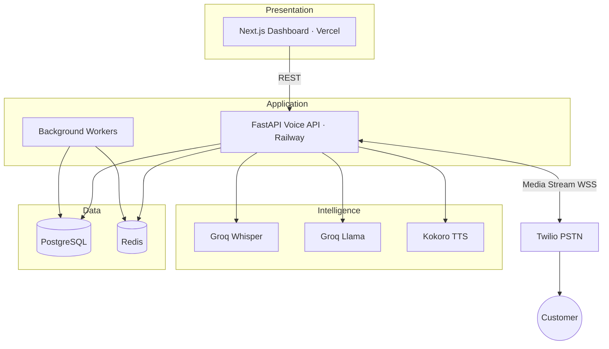

<div align="center">

# AI Calling Agent

### Real-time voice AI for outbound calls, CRM, and live analytics

[](https://nextjs.org/)
[](https://fastapi.tiangolo.com/)
[](https://www.twilio.com/)
[](https://groq.com/)
[](LICENSE)

**[Live Dashboard](https://frontend-omega-six-37.vercel.app)** · **[Technical Architecture](docs/ARCHITECTURE.md)** · **[Documentation](docs/README.md)** · **[Deploy Guide](docs/VERCEL_DEPLOY.md)**


---

## Overview

**AI Calling Agent** is a production-grade platform for AI-powered phone conversations: place outbound calls from a polished dashboard, stream audio through Twilio, transcribe with Whisper, reason with Llama, and respond with natural TTS — in **English and Hindi**.

Built for loan follow-up, sales, and support teams who need **low-latency**, **bilingual**, and **observable** voice automation.

| Capability | Detail |
|------------|--------|
| **Voice pipeline** | Twilio Media Streams → STT → LLM → TTS with barge-in |
| **Intelligence** | State machine, objections, intent scoring, escalation |
| **Enterprise** | Supabase CRM, call transcripts, Slack hot-lead alerts |
| **Scale** | Redis queue, background workers, Prometheus metrics |

---

## Technical architecture

The platform is a **four-layer voice AI system**: real-time telephony (Twilio + WebSocket), agentic dialogue (state machine + memory), enterprise CRM (PostgreSQL), and async scale-out (Redis workers + Prometheus).



| Layer | Responsibility | Docs |
|-------|----------------|------|
| **L1 — Voice** | 8 kHz audio, STT, TTS, barge-in | [Architecture §6](docs/ARCHITECTURE.md#6-real-time-voice-pipeline) |
| **L2 — Intelligence** | States, objections, intent, escalation | [Architecture §7](docs/ARCHITECTURE.md#7-conversation-intelligence) |
| **L3 — Enterprise** | CRM, analytics, Slack alerts | [Architecture §8–9](docs/ARCHITECTURE.md#8-data-architecture) |
| **L4 — Scale** | Job queue, metrics, tracing | [Architecture §10–11](docs/ARCHITECTURE.md#10-background-processing) |

**Full specification (diagrams, sequence flows, API catalog, ER model, security):**  
👉 **[docs/ARCHITECTURE.md](docs/ARCHITECTURE.md)**

---

## Quick start (local)

```bash
git clone https://github.com/KanavjeetS/-Real-Time-Voice-AI-Dashboard-Agent-Platform.git
cd -Real-Time-Voice-AI-Dashboard-Agent-Platform
cp .env.example .env   # add Groq + Twilio keys
docker compose up --build
```

| Service | URL |
|---------|-----|
| Dashboard | http://localhost:3000 |
| API | http://localhost:8000 |
| Health | http://localhost:8000/health |

For phone testing, run `ngrok http 8000` and set `TWILIO_WEBHOOK_BASE_URL` in `.env`.

---

## Deploy (24/7)

| Component | Host |
|-----------|------|
| Dashboard | **Vercel** |
| Voice API | **Railway** or **Render** |
| Database | **Supabase** |
| Cache / queue | **Redis Cloud** |

Full walkthrough: **[docs/VERCEL_DEPLOY.md](docs/VERCEL_DEPLOY.md)**

---

## Environment

See [`.env.example`](.env.example). Required for calls:

- `GROQ_API_KEY`
- `TWILIO_ACCOUNT_SID`, `TWILIO_AUTH_TOKEN`, `TWILIO_PHONE_NUMBER`
- `TWILIO_WEBHOOK_BASE_URL` (public HTTPS API URL)

---

## Project structure

```
├── frontend/              # Next.js operator dashboard
├── backend/
│   ├── app/api/routes/    # REST + Twilio WebSocket
│   ├── app/conversation/  # Dialogue orchestration (Layer 2)
│   ├── app/services/      # STT, LLM, TTS, CRM
│   ├── app/workers/       # Async jobs (Layer 4)
│   └── app/observability/ # Latency + Prometheus
├── docs/
│   ├── ARCHITECTURE.md    # ★ Primary technical reference
│   ├── DEPLOYMENT.md
│   ├── LATENCY.md
│   └── VERCEL_DEPLOY.md
├── scripts/init_db.sql
├── Dockerfile
└── docker-compose.yml
```

---

## License

MIT — see [LICENSE](LICENSE).
