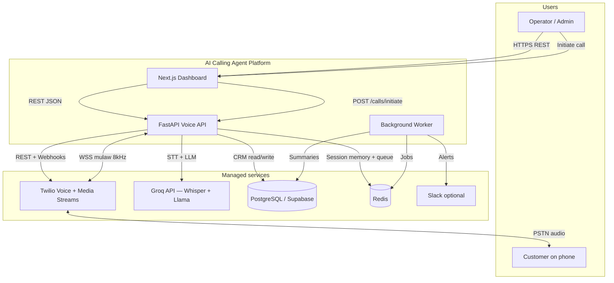
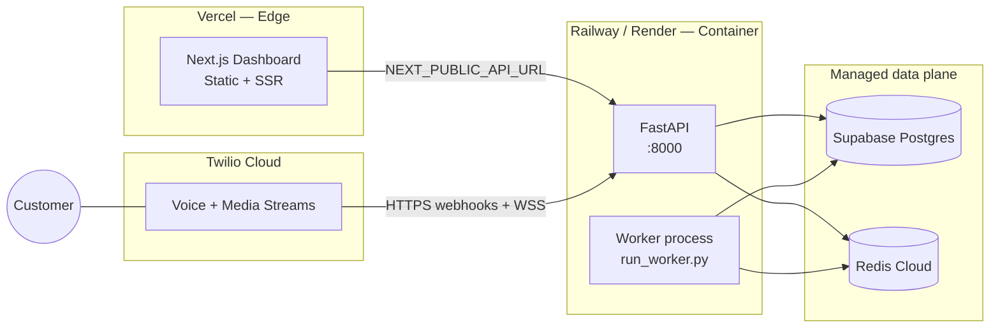
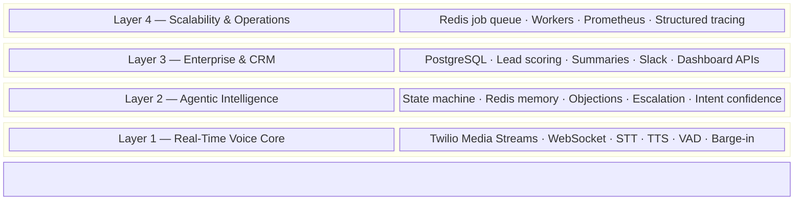
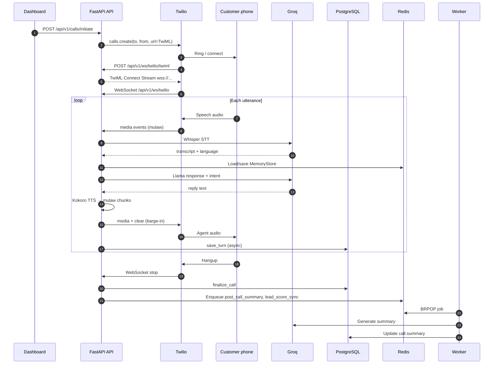
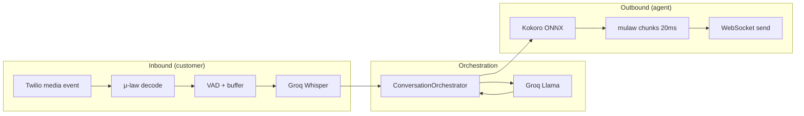
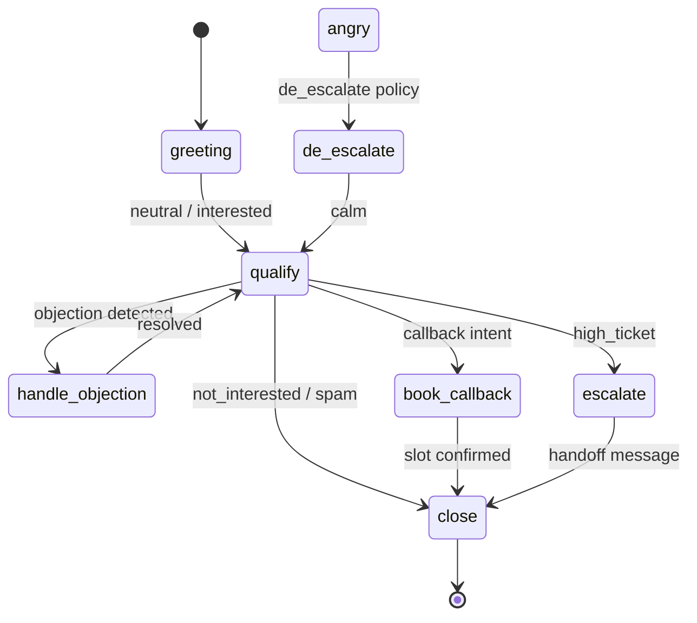
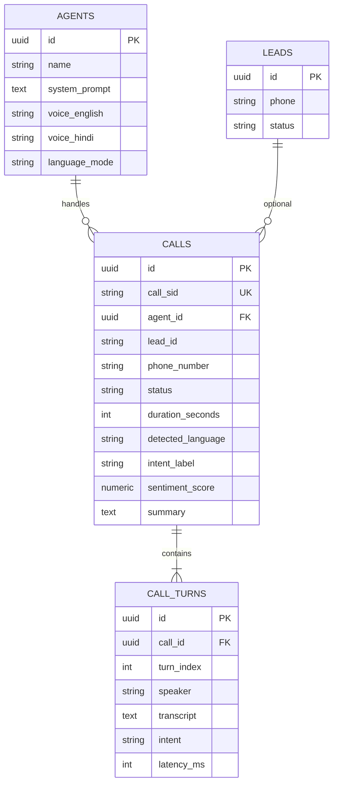
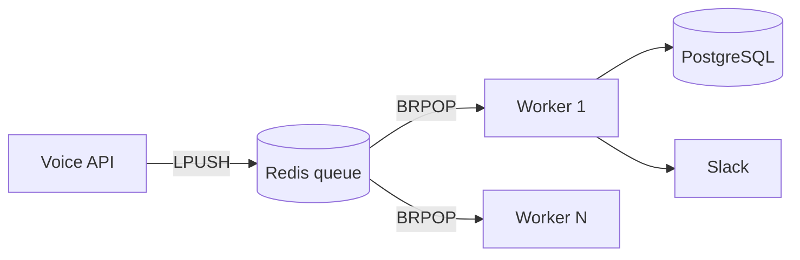

# Technical Architecture

**AI Calling Agent** — Production voice AI platform for outbound telephony, bilingual conversation, and CRM analytics.

| Document | Audience |
|----------|----------|
| This file | Engineers, architects, technical reviewers |
| [DEPLOYMENT.md](./DEPLOYMENT.md) | DevOps, SRE |
| [LATENCY.md](./LATENCY.md) | Performance engineering |
| [VERCEL_DEPLOY.md](./VERCEL_DEPLOY.md) | Cloud deployment |

---

## Table of contents

1. [Executive summary](#1-executive-summary)
2. [System context](#2-system-context)
3. [Deployment topology](#3-deployment-topology)
4. [Logical architecture (4 layers)](#4-logical-architecture-4-layers)
5. [Runtime: outbound call lifecycle](#5-runtime-outbound-call-lifecycle)
6. [Real-time voice pipeline](#6-real-time-voice-pipeline)
7. [Conversation intelligence](#7-conversation-intelligence)
8. [Data architecture](#8-data-architecture)
9. [API surface](#9-api-surface)
10. [Background processing](#10-background-processing)
11. [Observability & reliability](#11-observability--reliability)
12. [Security model](#12-security-model)
13. [Technology stack](#13-technology-stack)
14. [Repository map](#14-repository-map)
15. [Extension roadmap](#15-extension-roadmap)

---

## 1. Executive summary

AI Calling Agent is a **full-stack voice automation system** that:

- Places **outbound PSTN calls** via Twilio from a web dashboard.
- Streams bidirectional audio over **WebSockets** (Twilio Media Streams).
- Converts speech to text (STT), reasons with an LLM, and synthesizes replies (TTS) in **English or Hindi**.
- Persists transcripts, intents, and lead scores to **PostgreSQL** (Supabase-compatible).
- Offloads summaries and alerts to **Redis-backed workers** for non-blocking post-call work.

The backend is organized in **four composable layers** — voice transport, agentic dialogue, enterprise CRM, and horizontal scale — so each concern can evolve independently.

**Primary use cases:** loan follow-up, sales outreach, bilingual customer support pilots.

---

## 2. System context

External actors and systems that interact with the platform.



| Actor | Interaction |
|-------|-------------|
| **Operator** | Uses dashboard to dial numbers, select agents, view call history and analytics. |
| **Customer** | Answers phone; speaks with AI agent in real time. |
| **Twilio** | Dials PSTN, delivers TwiML, streams audio to/from API. |
| **Groq** | Cloud STT (Whisper) and LLM (Llama) inference. |
| **PostgreSQL** | Durable CRM: agents, calls, per-turn transcripts. |
| **Redis** | Conversation memory, job queue, optional caching. |

---

## 3. Deployment topology

Recommended production split (voice WebSockets cannot run on serverless-only frontends).



| Component | Hosting | Responsibility |
|-----------|---------|----------------|
| **Dashboard** | Vercel | UI, call initiation, stats visualization |
| **Voice API** | Railway / Render (Docker) | REST, WebSocket, STT/LLM/TTS on call path |
| **Worker** | Same or separate container | Post-call summary, lead score sync, Slack |
| **PostgreSQL** | Supabase / RDS | CRM persistence |
| **Redis** | Redis Cloud / ElastiCache | Queue + `MemoryStore` |
| **Twilio** | Twilio Console | Telephony + streaming |

**Critical configuration:** `TWILIO_WEBHOOK_BASE_URL` must be the **public HTTPS origin** of the Voice API (no trailing slash). TwiML and status callbacks are derived from this base URL.

---

## 4. Logical architecture (4 layers)

Layers stack from real-time audio at the bottom to async scale-out at the top. Each layer exposes clear module boundaries in `backend/app/`.



### Layer responsibilities

| Layer | Purpose | Key modules |
|-------|---------|-------------|
| **L1 Voice** | Sub-second audio loop with telephony constraints (8 kHz μ-law) | `ws_twilio.py`, `stt.py`, `tts.py`, `utils/audio.py` |
| **L2 Intelligence** | Structured dialogue instead of raw prompt chaining | `conversation/orchestrator.py`, `memory.py`, `states.py`, `objections.py`, `escalation.py` |
| **L3 Enterprise** | Business persistence and operator visibility | `services/crm.py`, `routes/dashboard.py`, `routes/analytics.py` |
| **L4 Scale** | Decouple slow work from call path | `workers/queue.py`, `workers/tasks.py`, `observability/*` |

---

## 5. Runtime: outbound call lifecycle

End-to-end sequence from dashboard click to CRM finalization.



| Phase | System behavior |
|-------|-----------------|
| **Initiation** | E.164 normalization (`utils/phone.py`), Twilio `calls.create`, optional `agentId` query param on TwiML URL. |
| **Media attach** | TwiML returns `<Connect><Stream url="wss://.../api/v1/ws/twilio">`. |
| **Greeting** | On `start` event: load agent, synthesize greeting TTS, stream 20 ms μ-law frames. |
| **Turn loop** | VAD detects end-of-utterance → STT → orchestrator → TTS; semaphore limits concurrent inference. |
| **Teardown** | Finalize call record; worker generates CRM summary and syncs lead score. |

---

## 6. Real-time voice pipeline

### Audio format

| Property | Value |
|----------|--------|
| Codec | G.711 μ-law (mulaw) |
| Sample rate | 8 kHz (telephony standard) |
| Chunk size | 160 bytes ≈ 20 ms per frame |
| STT input | PCM16 WAV wrapped from buffered utterance |

### Voice path diagram



### Barge-in

When the customer speaks while TTS is playing:

1. RMS energy exceeds `VAD_ENERGY_THRESHOLD`.
2. API sends Twilio **`clear`** event (stops buffered playback).
3. Next transcript is prefixed with `[Customer interrupted]` for LLM context.
4. `session.was_interrupted` flag coordinates turn state.

### Language handling

| Stage | Behavior |
|-------|----------|
| STT | Groq Whisper with optional `language` hint from session |
| Resolution | `utils/language.py` — script detection overrides mis-tagged Indian English |
| TTS voice | `af_sarah` (EN) / `af_sky` (HI) via Kokoro |
| LLM | System prompt augmented with language-specific instructions |

---

## 7. Conversation intelligence

`ConversationOrchestrator` replaces a naive **STT → single LLM → TTS** chain with governed dialogue.

### State machine



| State | Operator goal |
|-------|----------------|
| `greeting` | Identity, rapport |
| `qualify` | Loan need, amount, timeline (one question per turn) |
| `handle_objection` | Empathize + address price/time concerns |
| `book_callback` | Confirm callback window |
| `de_escalate` | Lower pace after frustration |
| `escalate` | Promise human follow-up within 24h |
| `close` | Polite goodbye, no new questions |

### Intent taxonomy

| Intent | Typical action |
|--------|----------------|
| `interested` | Continue qualification |
| `confused` | Simplify explanation |
| `angry` | De-escalate; track `angry_turns` in memory |
| `high_ticket` | Escalate + Slack alert |
| `callback` | Move to `book_callback` |
| `not_interested` | Graceful close |
| `spam_invalid` | End call |
| `neutral` | Continue current state |

**Confidence:** `LLMService.classify_intent_with_confidence()` returns `(label, 0.0–1.0)` used for transitions and **lead score** (0–1).

### Session memory (Redis)

`MemoryStore` persists per `call_sid`:

- Dialogue state, turn count, objections raised
- Extracted slots (loan amount, callback time)
- Facts map (e.g. angry turn counter)

Falls back gracefully if Redis is unavailable (in-memory path where implemented).

---

## 8. Data architecture

### Entity relationship



### Schema initialization

| Environment | Method |
|-------------|--------|
| Docker local | `scripts/init_db.sql` on first Postgres boot |
| Supabase | Auto-migrate missing tables via `app/db/session.py` (`agents`, `calls`, `call_turns`; skips existing `leads` if shared schema) |

### CRM write path

| Event | Persistence |
|-------|-------------|
| Call start | `CRMService.create_call_record` |
| Each turn | User + agent rows in `call_turns` (async) |
| Call end | `finalize_call` + worker summary |

---

## 9. API surface

Base URL: `https://<api-host>` · Prefix: `/api/v1` unless noted.

### REST endpoints

| Method | Path | Description |
|--------|------|-------------|
| `GET` | `/health` | Liveness: Groq, Twilio, DB flags |
| `POST` | `/calls/initiate` | Start outbound call |
| `POST` | `/ws/twilio/twiml` | Twilio TwiML webhook (also `?agentId=`) |
| `POST` | `/calls/status` | Twilio status callback |
| `GET` | `/calls` | List calls |
| `GET` | `/agents` | List agents |
| `GET` | `/agents/{id}` | Agent detail |
| `POST` | `/agents` | Create agent |
| `GET` | `/dashboard/stats` | Dashboard KPIs + recent calls |
| `GET` | `/analytics/latency` | STT/LLM/TTS percentiles |
| `GET` | `/analytics/overview` | Aggregated analytics |
| `GET` | `/metrics` | Prometheus scrape (root mount) |

### WebSocket

| Path | Protocol | Role |
|------|----------|------|
| `/api/v1/ws/twilio` | Twilio Media Streams JSON | Bidirectional call audio + events |

### Debug (non-production only)

`APP_ENV != production` → `/api/v1/debug/*` (providers, llm-test, smoke-test, tts-test).

---

## 10. Background processing



| Job type | Trigger | Action |
|----------|---------|--------|
| `post_call_summary` | Call finalized | LLM bullet summary → `calls.summary` |
| `lead_score_sync` | Call finalized | Persist orchestrator lead score |
| `slack_alert` | Hot intent during call | Webhook to `SLACK_WEBHOOK_URL` |
| `crm_sync` | Extension point | External CRM integration |

**Run worker:** `python backend/run_worker.py` · Scale horizontally with multiple processes.

---

## 11. Observability & reliability

### Metrics

| Signal | Location |
|--------|----------|
| Prometheus histograms | `GET /metrics` — STT, LLM, TTS, turn total |
| Per-turn JSON | `TurnLatency` → dashboard + `/analytics/latency` |
| Structured logs | `structlog` with `call_sid` context |

### SLO targets

See [LATENCY.md](./LATENCY.md). Summary:

| Metric | Target |
|--------|--------|
| End-to-end turn | &lt; 2.5 s (median goal) |
| p95 turn | &lt; 4 s |

### Failure modes

| Failure | System response |
|---------|-----------------|
| Groq rate limit | Exponential backoff (3 retries) |
| STT error | Empty transcript; skip turn (no WS crash) |
| TTS error | Log + skip audio chunk |
| DB unavailable | Default agent; calls work; CRM degraded |
| Redis unavailable | Memory/queue degraded per implementation |

### Concurrency controls

- `asyncio.Semaphore(MAX_CONCURRENT_CALLS)` on inference path
- `CALL_TIMEOUT_SECONDS` watchdog on WebSocket session
- Single active turn processor per call (`_processing_turn`)

---

## 12. Security model

| Area | Practice |
|------|----------|
| **Secrets** | `.env` only; never committed (see `.env.example`) |
| **Production** | `APP_ENV=production` disables `/docs` and debug routes |
| **CORS** | `CORS_ORIGINS` JSON list — include Vercel dashboard origin |
| **Telephony** | Twilio credentials; trial accounts require verified destination numbers |
| **Database** | TLS to Supabase (`sslmode=require` stripped for asyncpg) |
| **Redis** | Password in connection URL |

**Recommended additions for hardened production:** Twilio request signature validation on all webhooks, API authentication on dashboard routes, secrets manager (Railway/Vercel env).

---

## 13. Technology stack

| Layer | Technology | Version / notes |
|-------|------------|-----------------|
| Frontend | Next.js, React, Tailwind | 14.x |
| API | FastAPI, Uvicorn | Python 3.11 |
| ORM | SQLAlchemy 2 async | asyncpg driver |
| Telephony | Twilio Voice + Media Streams | — |
| STT | Groq Whisper (`whisper-large-v3`) | `MODEL_TIER=free` |
| LLM | Groq Llama (`meta-llama/llama-4-scout-17b-16e-instruct`) | Intent: `llama-3.1-8b-instant` |
| TTS | Kokoro ONNX | CPU; models in `backend/models/kokoro/` |
| Cache / queue | Redis | Lists + key-value |
| DB | PostgreSQL | Supabase-compatible |
| Metrics | Prometheus client | `/metrics` |
| Containers | Docker multi-stage | Non-root `appuser` |

### Model tiers

| Tier | STT | LLM | TTS |
|------|-----|-----|-----|
| `free` (default) | Groq Whisper API | Groq Llama | Kokoro local |
| `balanced` | faster-whisper local | Groq Llama | Kokoro |
| `full` | faster-whisper | vLLM (optional) | Kokoro |

---

## 14. Repository map

```
ai-calling-agent/
├── frontend/                 # Next.js dashboard (Vercel)
│   └── src/app/page.tsx      # Operator UI
├── backend/
│   ├── main.py               # FastAPI app factory
│   ├── app/
│   │   ├── api/routes/       # REST + WebSocket handlers
│   │   ├── conversation/     # Layer 2 orchestration
│   │   ├── services/         # STT, LLM, TTS, CRM
│   │   ├── workers/          # Layer 4 jobs
│   │   ├── observability/    # Latency + tracing
│   │   ├── models/           # SQLAlchemy ORM
│   │   └── utils/            # phone, audio, language
│   └── run_worker.py
├── docs/                     # Architecture & ops (this file)
├── scripts/init_db.sql       # Postgres DDL
├── Dockerfile                # API production image
├── docker-compose.yml        # Local full stack
└── railway.toml / render.yaml
```

---

## 15. Extension roadmap

| Initiative | Benefit |
|------------|---------|
| Streaming STT (partial transcripts) | Lower time-to-first-token |
| Streaming LLM → chunked TTS | Sub-second perceived latency |
| Twilio signature validation | Webhook security |
| Grafana on Prometheus | SRE dashboards |
| SIP human handoff on `escalate` | Live agent transfer |
| Shared Redis TTS cache | Consistency across API replicas |

---

## Related documents

- [DEPLOYMENT.md](./DEPLOYMENT.md) — Docker, env vars, production checklist  
- [LATENCY.md](./LATENCY.md) — SLOs, measurement APIs, optimizations  
- [VERCEL_DEPLOY.md](./VERCEL_DEPLOY.md) — Vercel + Railway split deploy  

**Live API docs (development):** `http://localhost:8000/docs` when `APP_ENV=development`.
